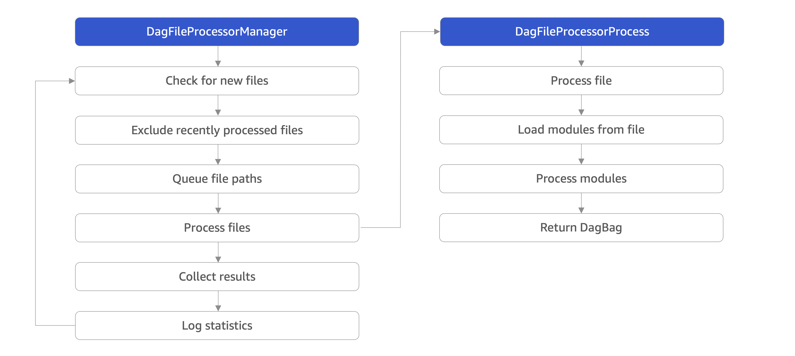

--- 

## Description

Apache Airflow is a great tool for data processing and similar pipelines. But there are some
drawbacks and catches that can make it painful to work with. I want to talk about the mistakes we
made and how it led us to the design that we're currently using. I will also mention a few concepts
that we decided to use (protocol classes, dataclasses).

--- 

# Outline

1. What is Airflow and what is it good for

2. Bloated global scope
    - Explain briefly how Airflow scheduler works
    - Why it's good to move heavy imports elsewhere (e.g. pandas)
    - Where to work with airflow variables (and where to avoid them)

3. Dags are hard to test
    - Setting up environment locally is hard (if not impossible)
    - Unit tests with connections created deep in stack requires ugly mocking

4. Build layer between Airflow and own code
    - Move all custom code to separate modules
    - Create resources high in a stack (e.g. database connection, http hooks, ...)
    - Use dataclass (or similar) for parameter encapsulation

5. Testing and debugging made easy
    - Easy unit testing with resources using protocol classes
    - Python debug mode enable even with production data

---

# What is Airflow

---

```python
dag = DAG(
    dag_id="data_processing",
    start_date=datetime(2023, 9, 1),
    schedule_interval="@daily",
)


def do_something_callable():
    """Implementation of 'doing something'."""


do_something = PythonOperator(
    task_id="do_something",
    python_callable=do_something_callable,
    dag=dag,
)
```

---

```python
with DAG(
    dag_id="data_processing",
    start_date=datetime(2023, 9, 1),
    schedule_interval="@daily",
) as dag:
    @dag.task()
    def do_something_callable():
        """Implementation of 'doing something'."""
```

*not what we use

---

# Use cases

- ETL pipeline
- ML automation
- literally anything regular

---



Runs every few seconds - keep it light!

---

```python
import datetime
import airflow
import pandas

def do_something_callable():
    """Implementation of 'doing something'."""
    pandas.read_parquet(...)
```

```shell
time python dags/data_processing.py
# 1,39s user 0,70s system 166% cpu 1,254 total
```

---

```python
import datetime
import airflow

def do_something_callable():
    """Implementation of 'doing something'."""
    import pandas
    pandas.read_parquet(...)
```

```shell
time python dags/data_processing.py
# 0,58s user 0,06s system 99% cpu 0,641 total
```

---


Do not read airflow variables in global scope, either!

---

```python
from airflow.models import Variable

LEARNING_RATE = float(Variable.get("learning_rate"))

def do_something_callable():
    """Implementation of 'doing something'."""
    train_model(LEARNING_RATE)
```

```shell
python dags/machine_learning.py
# KeyError: 'Variable learning_rate does not exist'
```

--- 

# Running in local / CI environment

- Setting up resources (e.g. database)
- Simulating upstream tasks in the DAG
- Not having any side effects in production environment!

---


# Unit testing

Requires monkey-patching

```python
def read_data():
   engine = PostgresHook("db_conn").get_conn()
   sql = "..."
   with engine.begin() as con:
      return pd.read_sql(sql, con)
```

- Patch method `PostgresHook.get_conn`
- Anything else? Are you sure? What about `PostgresHook.__init__`?

---

# Protocol classes

```python
class PostgresHookProtocol(Protocol):

    def get_conn(self) -> Engine:
        ...

def read_data(hook: PostgresHookProtocol):
   engine = hook.get_conn()
   sql = "..."
   with engine.begin() as con:
      return pd.read_sql(sql, con)
```

---


```python
class PostgresHookMock:
   
   def get_conn(self) -> Engine:
      return sqlite3.connect(":memory:")
   
   
def test_reading_data():
    hook = PostgresHookMock()
    data = read_data(hook)
```

---


# Airflow variables

- Same story as connections / hooks - require some form of patching
- Protocol classes are overkill as you would need to implement only `get` method
- It's not that about typying, but you also need some meaningful value
- Everything is a string - use json/toml and convert to dataclass/attrs/pydantic/typeddict
- Encapsulation by variable name prefix is not good - too many variables

---

# Separate layers

- DAG
  - Communicates with airflow database
  - Uses airflow library
  - Collects variables and connections
- Custom code
  - Has no clue that airflow exists
  - Everything is typed using protocol classes and dataclasses

